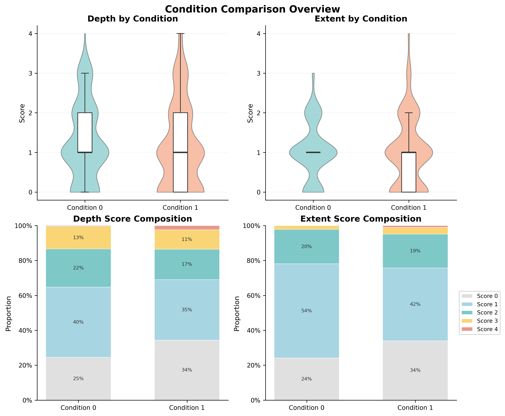

# Periorbital Bruising After Eyelid Surgery — Randomized Blinded Trial Analysis

**Clinical question:** Does irrigation saline temperature reduce post-operative bruising after eyelid surgery?
**Setting:** Mount Sinai | n = 32 patients | Grader-blinded RCT | Python statistical pipeline

---

## The Problem

Post-operative bruising after eyelid surgery is the most patient-visible complication of the recovery period. A simple intraoperative change — adjusting the irrigation saline temperature — has been proposed as a low-cost intervention to reduce it. The study enrolled 32 patients, assigned each to one of two temperature conditions, and had two independent blinded graders score eight periorbital photographs per patient on **depth** (severity, 0–4) and **extent** (area, 0–4).

The analytical challenge was significant: 512 observations from 32 patients, with **four nested levels of non-independence** (grader → quadrant → eye → patient) and ordinal outcomes that most software packages would naively treat as continuous.

---

## Why the Analysis Was Hard

A simple t-test or ANOVA would have been wrong — and badly so. The dataset's structure violated several foundational assumptions:

| Challenge | Consequence if ignored |
|---|---|
| Observations clustered within patients (16 per patient) | SE underestimated by **2.7×**; false positives inflated |
| Outcome is ordinal 0–4, not continuous | Linear model assumptions violated; efficiency loss |
| Two graders with systematic bias (+0.18 points for Grader 1, p < 0.001) | Uncontrolled confounding of the treatment estimate |
| Treatment assigned at patient level, not eye level | Paired within-patient contrast is unrecoverable |
| Only 32 patients | Standard errors dominate; power is critical to quantify |

Ignoring the clustering alone would have produced confidence intervals **2.7× too narrow** — a textbook case of pseudoreplication.

---

## The Analytical Approach

A **multi-model ensemble** was built so that conclusions could not depend on any single model's assumptions:

1. **Linear Mixed Model (LMM)** — patient random intercept, grader and procedure as fixed effects. Workhorse model; provides variance decomposition.
2. **Cumulative Link Mixed Model (CLMM)** — respects the ordinal 0–4 scale via proportional odds. Fitted in R via `ordinal::clmm` from Python using `rpy2`.
3. **GEE (ordinal)** — population-averaged estimates with exchangeable within-patient correlation and robust sandwich SE. Tests whether the LMM's conditional approach changes the conclusion.
4. **GEE (binary)** — clinical translation: any bruising (≥ 1) and significant bruising (≥ 2), with odds ratios, risk differences, and NNT.
5. **Nonparametric + permutation** — Mann-Whitney U and 10,000-iteration permutation on patient-level means. Model-free robustness check.
6. **Sensitivity suite** — random-effects structure, grader averaging, interaction terms, Bonferroni/BH multiple comparison correction.

The rationale: if LMM, CLMM, and GEE all agree despite making fundamentally different assumptions about the outcome distribution and the source of clustering, the conclusion is robust.

---

## Results

### Condition effect — all models agree

| Model | Outcome | Estimate | 95% CI | p-value | Effect size |
|---|---|---|---|---|---|
| LMM | Depth | β = −0.034 | −0.487 to 0.420 | 0.885 | d = −0.045 (negligible) |
| LMM | Extent | β = +0.029 | −0.258 to 0.316 | 0.844 | d = +0.044 (negligible) |
| CLMM | Depth | OR = 0.822 | 0.300 to 2.251 | 0.702 | Near unity |
| CLMM | Extent | OR = 1.006 | 0.474 to 2.139 | 0.987 | Near unity |
| GEE-Binary | Depth ≥ 1 | OR = 0.703 | 0.372 to 1.330 | 0.279 | NNT = 10.2 |
| GEE-Binary | Extent ≥ 2 | OR = 1.256 | 0.576 to 2.741 | 0.566 | NNH = 41.1 |

All p-values exceeded 0.70 for the primary outcomes. LMM and GEE-Ordinal returned **identical point estimates to three decimal places** — strong evidence the result is not a modeling artifact.

### Score distributions by condition

*Violin plots (top) and stacked score proportions (bottom) for depth and extent. The distributions are nearly indistinguishable across conditions, consistent with the null model estimates.*

---

## What the Analysis Revealed

**No treatment effect** — but the analysis itself produced clinically actionable findings:

- **The dominant predictor was procedure type, not treatment.** Procedure code 3 drove depth scores up by 0.68 points (p = 0.006) and extent by 0.57 points (p < 0.001). Future trials must stratify randomization by procedure type.

- **The study was severely underpowered.** Post-hoc power was 7.2% (depth) and 5.5% (extent). To detect the observed effect size at 80% power would require **571–2,786 patients per group**. The minimum detectable effect was ~1.0 SD — an implausibly large treatment response.

- **The paired design was not recovered in the data.** Treatment was recorded at the patient level; no quadrant-to-eye mapping existed. A properly executed paired eye-level design would eliminate 41% of residual variance (the patient ICC), potentially tripling effective power without enrolling more patients.

- **Grader calibration is needed.** ICC = 0.515 for depth (below the pre-specified 0.75 threshold), with a systematic +0.18 upward bias from Grader 1. For extent, ICC = 0.888 — acceptable.

---

## Stack

`Python` · `statsmodels` (LMM, GEE) · `pingouin` (ICC) · `scipy` (nonparametric, permutation) · `rpy2` + R `ordinal` (CLMM) · `pandas` · `matplotlib` · `LaTeX` (manuscript)
